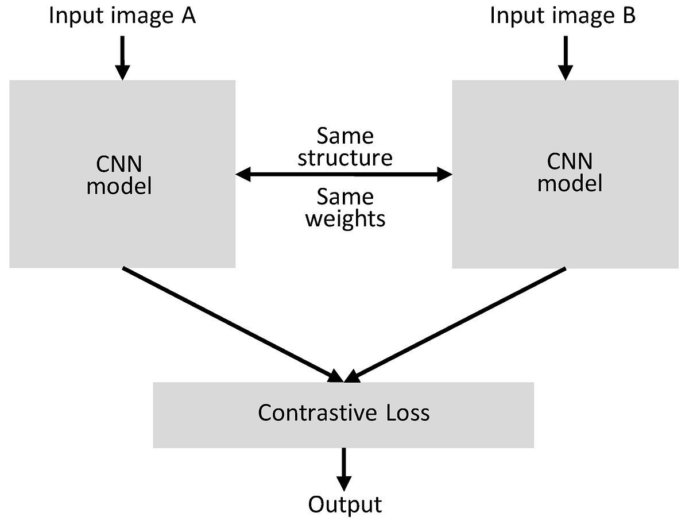
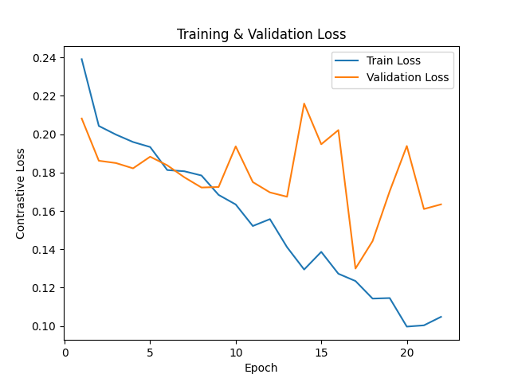
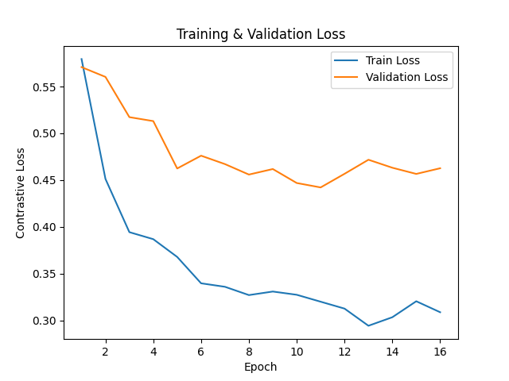
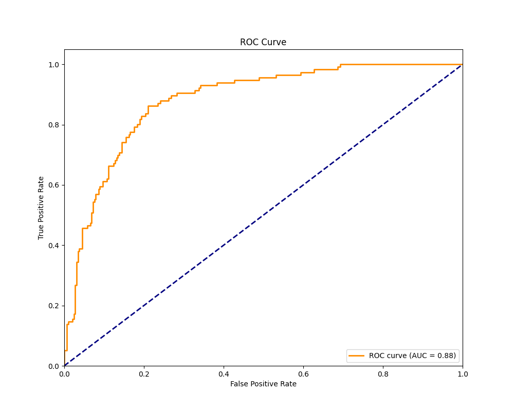
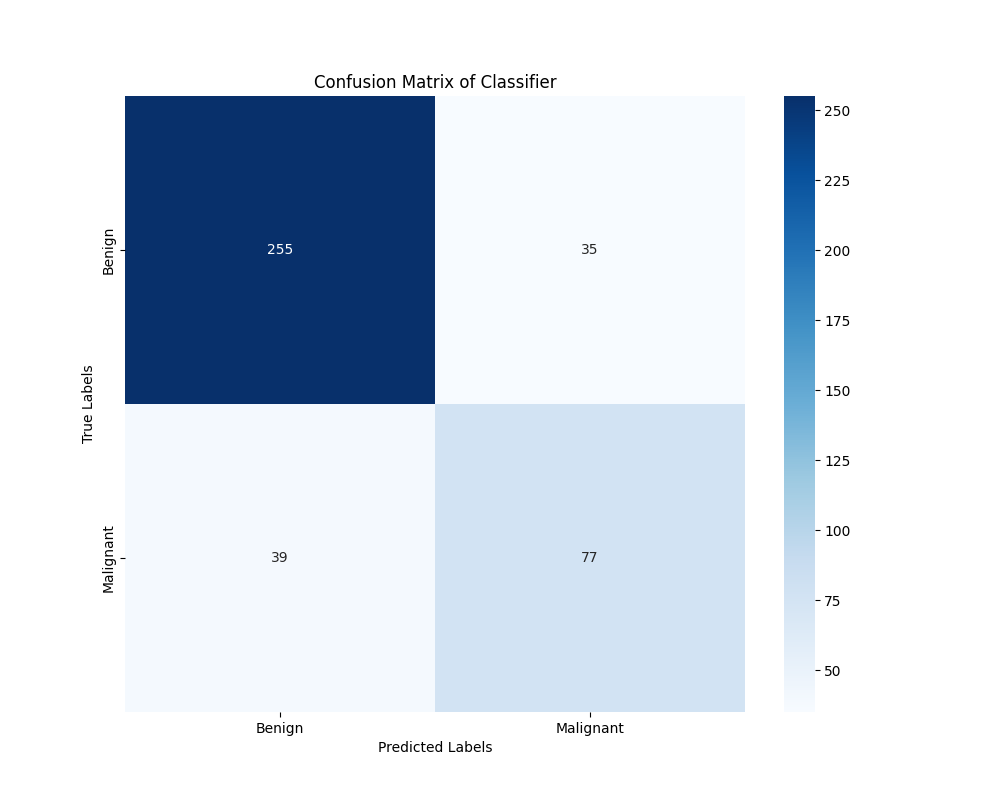
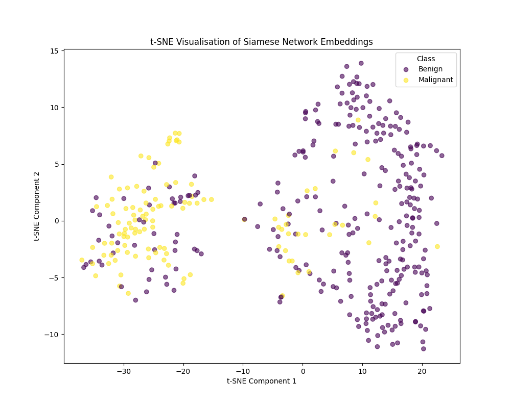
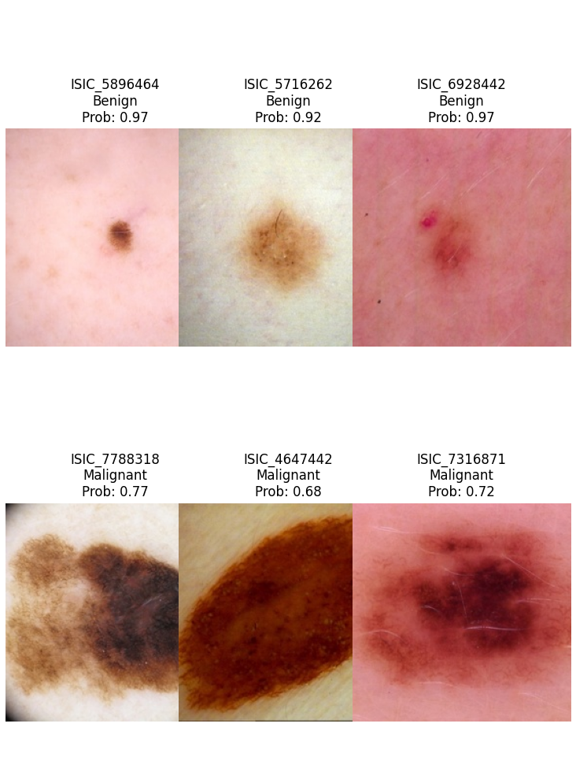

# Using a Siamese neural network for classification on the ICIS 2020 dataset.

## Problem Description

This project uses a Siamese network alongside a Binary Classifier to classify images from the ICIS 2020 dataset, in particular, detecting Melanoma Skin Cancer. The primary objective is to distinguish between benign (non-cancerous) and malignant (cancerous/melanoma) lesions. The Siamese network processes pairs of images, learning to measure their similarity. This enables classification of skin lesions based on visual similarity. After it has been trained, the Binary Classifier will use the embeddings from the Siamese network to predict whether a given skin lesion is benign or malignant.

## Models

### Siamese Network

A Siamese network is a neural network designed to compare two input samples, in this case, image pairs. The network learns to embed images into a feature space such that similar images are put close together and dissimilar further apart. The network contains two identical sub-networks that share weights. The output is a pair of embeddings that can be compared by a loss function. One of the common ones is contrastive loss. This model is represented in the following figure 1:

*Figure 1: Siamese Network*


In this project, the ResNet-18 model was used as the base model, a widely used deep CNN. ResNet-18 introduces residual connections to a standard deep CNN, which allows for deeper layers and better gradient flow. This model was used with its Default weights that were trained on IMAGENET1K. (Resnet18 — Torchvision Main Documentation, 2024)

#### Contrastive Loss

The loss function for the Siamese networks is Contrastive loss. In this project, a slight variation is used that is adjusted for batch comparisons. The equation for this is given by (GeeksforGeeks, 2024):

$$ \mathbb{L} = \frac{1}{2N} \sum_{i=1}^N (y_i * d_i^2 + (1-y_i)*max(0, m-d_i)) $$

Where:
- $y_i$ is binary label,
- $d_i$ is Euclidean distance between embeddings of two images,
- $m$ is margin that ensures classes are sufficiently far apart,
- N is total number of image pairs in batch.

### Binary Classifier

The Binary Classifier is a simple neural network used on the Siamese network's embeddings. This model is trained to convert the embeddings into class predictions  that will be thresholded such that 0 is benign and 1 is malignant (melanoma). After the Siamese network is trained, the image embeddings generated are processed through the Binary Classifier.

The criterion/loss function for the Binary Classifier was chosen to be Binary Cross-Entropy with Logits Loss or BCEWithLogitsLoss (BCEWithLogitsLoss — PyTorch 2.7 Documentation, 2024)

To determine the stopping metric, AUC-ROC was used. These measures represent the probability, given a random positive and negative sample, that it will rank the positive higher than the negative. (Google Developers, 2019)

### Optimiser

Both models used the same optimiser, Adam (Adaptive Moment Estimation), with a learning rate of 1e-4 for Siamese and 5e-5 for Classifier, other rates were tested but would make training unstable or the model would greatly overfit the training data.

## Example Usage

1. Clone repository, checkout branch and go to files. 
```bash
git clone https://github.com/Bangu7/PatternAnalysis-2025.git
cd PatternAnalysis-2025
git checkout topic-recognition
cd recognition/siamese_s4810380
```
2. The list of dependencies with their versions is located within [requirements.txt](./requirements.txt). These can be installed with pip:
```bash
pip install -r requirements.txt
```
3. A resized version of the dataset was taken from [kaggle](https://www.kaggle.com/datasets/nischaydnk/isic-2020-jpg-224x224-resized). These images are resized to 224x224 pixels; this is the necessary size for the base ResNet model used in the Siamese network (Images are automatically transformed to this size). After unzipping, place this dataset locally in a folder called `data/`
4. To train a model, use `python train.py` with the necessary flags found with `python train.py -h`. For example, the following will train a model from scratch with 5 epochs and verbose printing, the models will be stored in the created directory `./model/10/`: 
```bash
python train.py -train -m 10 -e 5 -v
```

5. Following the above example, these models can be evaluated, and performance plots can be produced with the following command (training and evaluation can be combined in one command):
```bash
python train.py -eval -m 10 -p 
```
The produced plots will be saved in the same directory as the models, `./model/10/`.

6. The models can then be used for further predictions with [predict.py](predict.py). Help on flags is available through `python predict.py -h`. Example usage:
```bash
python predict.py -m 10 -meta ./data/train-metadata.csv -img ./data/train-image/image/ -out predict.csv
```

## Pre-processing

Due to the significant class imbalance, 32542 benign and 584 malignant, the benign were undersampled by sampling a 2.5:1 ratio of benign:malignant. Although losing a large portion of data, Siamese networks work well with little data (Benhur, 2020). This also gives quicker training times (more epochs). The proportions can be played with in `dataset.py`; however, 2.5:1 was deemed reasonable. 

To counteract the minimal dataset issues, random transforms were performed on the training images to increase the variety of images, improving generalisation.

The dataset was processed into training, validation and testing subsets of 70/10/20, respectively. This allowed for the majority of the data to be used in training while still enough to effectively evaluate the models performance.

## Results

### Training Loss

*Figure 2: Siamese Network Loss*



The training loss of the Siamese Network indicates that the model begins to overfit, as seen by the validation loss not decreasing with the training loss. Fortunately, due to early stopping based on the best validation AUC-ROC, the model was last saved at epoch 17 when validation loss reached a minimum.

*Figure 3: Classifier Loss*



In contrast, the Classifier has a steadier decay as training and validation loss decrease together. This indicates it is generalising well and has less overfitting. The model appears to slowly flatten out indicating little reward for more epochs.

### ROC Curve

*Figure 4: AUC-ROC curve of Classifier* 



The AUC-ROC plot displays the classifiers ability at distinguishing benign and malignant across different decision thresholds. Perfect separability is a score of 1.0. In this case, the model achieved a high 0.88 AUC on the test set, indicating strong performance in distinguishing. This means the Siamese network likely provides a useful separation (visualised in t-SNE). However, there is still space to improve results and capture subtle features.

### Confusion Matrix

*Figure 5: Confusion Matrix of Classifier* 



The confusion matrix provides a breakdown of how the classifier performed in predicting malignant vs benign. From Figure 5, there was:
- 255 True Negatives
- 35 False Positives 
- 39 False Negatives
- 77 true-positives

This means the classifier correctly identified majority of the benign lesions, but struggled more with malignant, classifying 39 out of 116 of them as benign. The current decision threshold that the model was trained with classifies a lesion as malignant when the model is at least 60% confident. Depending on desired priorities, the threshold could be adjusted. Lowering the threshold would increase sensitivity by identifying more malignant predictions, but likely increases false positive predictions, resulting in more benigns incorrectly predicted as malignant.

### t-SNE Embedding Plot

*Figure 6: t-SNE of Siamese Embeddings* 



(Awan, 2023) t-SNE is an unsupervised non-linear dimensionality reduction technique. The plot it generates gives us an idea of how the Siamese Network embeds the images. There is an indication of separation between the two classes. However, there is still a fair bit of overlap. Particularly with a benign being in what appears to be a malignant cluster on the left. These benign lesions likely have similar features to the malignancies, making it harder for the model to distinguish between.

### Example Predictions

From the trained model, some example inputs with their outputted label are given in Figure 7:

*Figure 7: Models' Predictions of 'un-labelled' images*


In this figure, the only malignant is ISIC_7788318, and the model correctly assigns it as such with a probability of 0.77. However, the model incorrectly predicted the other two images in row 2 as malignant, which is likely due to the appearance. From this example, we can see that the model appears to have a bias towards the size of the lesion as a heavy indicator as to whether a given lesion is cancerous. This over-reliance likely is what contributes to false-positives for large benign lesions.

### Performance Summary on Test Set

| Measure | Score |
|---------|-------|
| Accuracy | 0.8177 |
| AUC-ROC | 0.8806 |
| F1-Score | 0.6754 |

Overall, the model achieved a 0.8806 AUC-ROC score (with 81.77% general accuracy), meaning it achieved the required 0.8 accuracy on the test set.

## Notes

- This model was trained locally on a GTX 1060; thus, with better equipment, more training could be provided with more thorough hyperparameter tuning.

## References

- Nischay Dhankhar. (2020). ISIC 2020 JPG 224x224 RESIZED. Kaggle.com. [https://www.kaggle.com/datasets/nischaydnk/isic-2020-jpg-224x224-resized/data]
- GeeksforGeeks. (2024, July 10). Loss Functions in Deep Learning. GeeksforGeeks. [https://www.geeksforgeeks.org/deep-learning/loss-functions-in-deep-learning/]
- ritvikmath. (2024, December 9). Contrastive Loss: Data Science Basics. YouTube. [https://www.youtube.com/watch?v=dC3_IKaBXTk]
- Awan, A. A. (2023, March). Python t-SNE with Matplotlib. Www.datacamp.com. [https://www.datacamp.com/tutorial/introduction-t-sne]
- Benhur, S. (2020, September 2). A friendly introduction to Siamese Networks. Medium; TDS Archive. [https://medium.com/data-science/a-friendly-introduction-to-siamese-networks-85ab17522942]
- BCEWithLogitsLoss — PyTorch 2.7 documentation. (2024). Pytorch.org. [https://docs.pytorch.org/docs/stable/generated/torch.nn.BCEWithLogitsLoss.html]
- resnet18 — Torchvision main documentation. (2024). Pytorch.org. [https://docs.pytorch.org/vision/main/models/generated/torchvision.models.resnet18.html#torchvision.models.ResNet18_Weights]
- Google Developers. (2019). Classification: ROC Curve and AUC  |  Machine Learning Crash Course. Google Developers. [https://developers.google.com/machine-learning/crash-course/classification/roc-and-auc]
- Grammarly. (2025). Grammarly. Grammarly.com. [https://app.grammarly.com/]
